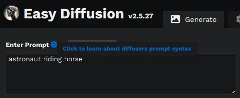
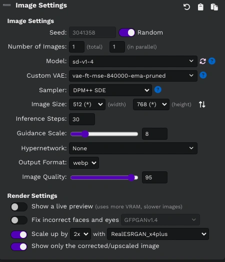
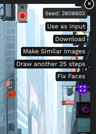

# easydiffusion-plugins

My plugins for [EasyDiffusion](https://github.com/cmdr2/stable-diffusion-ui).

## UI Plugins

| Name | Description | Screenshot |
| ---- | ----------- | ---------- |
| [prompt-help-button.plugin.js](ui/prompt-help-button.plugin.js) | Adds a help button for prompt syntax (diffusers only) |  |
| [switch-height-width.plugin.js](ui/switch-height-width.plugin.js) | Adds a button to switch the height and width values |  |
| [view-full-size-image.plugin.js](ui/view-full-size-image.plugin.js) | Adds a button to view rendered image in full size. **Note** this plugin is unnecessary now since the functionality was added to EasyDiffusion. |  |
