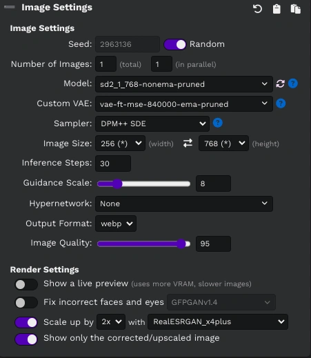

# easydiffusion-plugins

My plugins for [EasyDiffusion](https://github.com/cmdr2/stable-diffusion-ui).

## UI Plugins

| Name | Description | Screenshot |
| ---- | ----------- | ---------- |
| [switch-height-width.plugin.js](ui/switch-height-width.plugin.js) | Adds a button to switch the height and width values |  |
